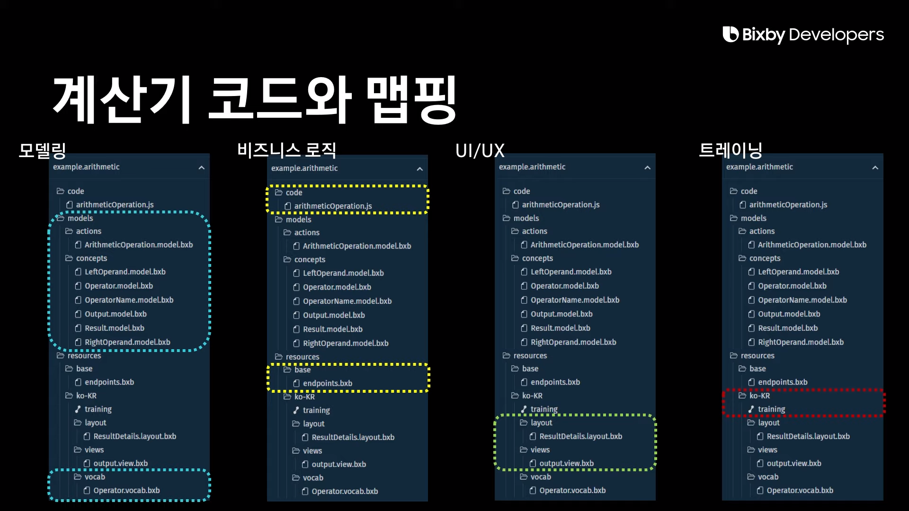

# 2강. BIxby Capsule 기본 개념

---

## 1. Bixby 서비스 아키텍처와 Capsule 구조

###   1) Bixby 서비스 아키텍처

- 음성 인식과 자연어 이해

- ```
  발화: 사람이 말하는 음성 언어.
  
  ASR(Automatic Speech Recognition): 발화를 문자로 변환하는 기술.
  -text: 오늘 서울 날씨 알려 줘
  
  NLU(Natural Language Understanding): 문장의 의미를 이해하는 기술.
  -text: 오늘 / 서울 / 날씨 / 알려 줘
  ```


<br/>

###    2) Capsule 구조


- Concept이 값이라면 Action은 그 값을 활용하는 동작이다.



- 모델링 부분

  계산을 수행하는 action 파일

  피연산자, 연산 종류 등 계산에 필요한 값을 나타내는 concept 파일

  concept 값에 대한 예시 발화를 모아 놓은 vocab 파일

- 비즈니스 로직 부분

  실제 동작하는 코드를 구현한 js 파일

  그 코드와 모델링한 actiond을 mapping하는 endpoints 파일

- UI/UX 파일

  계산한 결과를 표현하는 layout, view 파일

---

## 2. Bixby 개발 기본 개념 

###   1) Modeling

- bixby capsule을 만드는 것은 사용자가 원하는 일을 이해해서 이를 실행시켜 줄 수 있도록 하는 일이다.
- 사용자는 언어를 통해서 원하는 것을 기술하고 빅스비는 우리가 정의한 틀에 따라 이를 이해하고 수행한다.
- 빅스비는 명령을 실행하기 위해 문장을 적합한 단위 요소로 이해한다.


- 처리하고자 하는 사용자 요청을 이해하고자 concept과 action을  정의해서 구조를 만드는데, 이를 modeling이라 한다.


