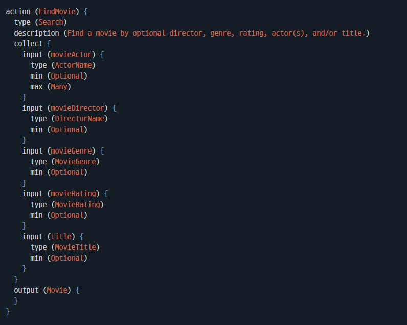
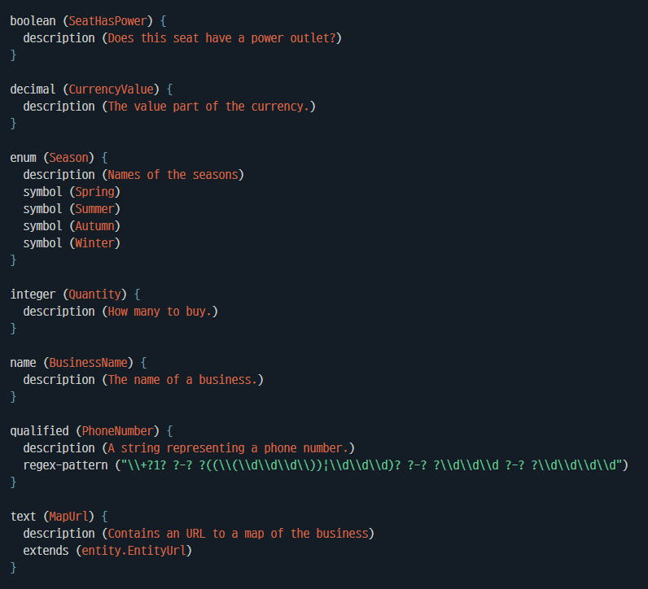
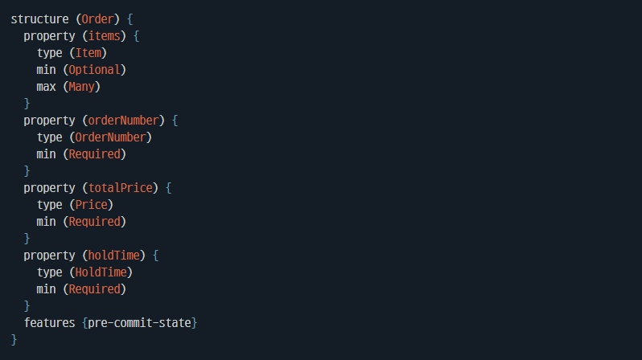

# 3강. Modeling 구현

------

## 1. Modeling - Action & Concept

### 1) Action



- Action명: Action의 이름.

- Type: Action의 종류를 설정하는 부분, Bixby 시스템이 Action을 검색할 때 힌트를 준다.

- Input: Action 실행에 필요한 입력 값을 지정하는 부분.

  - 변수명: Action에서 해당 Concept이 사용되는 이름.

  - Concept명: Concept의 이름.

  - Min & Max: 발화로부터 이 Input을 몇 개 받아들일지 결정한다.

    ```
    - Min
     Required: 필수로 받아야 하는 input.
     Optional: 선택.
     
    - Max
     One: 하나의 input만을 받을 수 있다.
     Many: 여러 개의 input을 받을 수 있다.
    ```

    

- Output: Action 실행의 결과

<br/>

###    2) concept

- Primitives 타입

  - Primitive 타입은 기본형 변수라고도 하며, 총 9가지가 있다.

  

  ```javascript
  - Boolean: True/False
  - Decimal: 실수형 숫자.
  - Integer: 정수형 숫자.
  - Enum: 열거할 수 있는 문자열을 저장하는 타입.
     // Vocab 파일이 존재하지 않는다면 enum 타입은 자연어를 인식할 수 없다.
  - Name: 짧은 문자열.
  - Qualified: Name과 기본적으로 비슷하지만 지정 패턴에 맞는 데이터를 저장.
  - Text: 긴 문자열.
     // Vocab을 사용 불가능. 때문에 URLs, XML, JSON, 여러 문장으로 구성된 리뷰 등에 적합하다.
  ```

- Structure 타입

  - Primitive 타입들을 묶어서 하나의 객체로서 사용하는 타입이다.

  

  ```
  - Structure명: Structure의 이름.
  - Property: Structure의 일부분이 될 Concept.
    - Property명: 해당 Structure에서 사용될 Concept의 이름.
    - Type: Concept의 이름.
    - Min & Max: 해당 structure에서 가질 수 있는 이 Concept의 개수.
  ```

  

---

## 2. 유연한 Modeling을 만드는 여러 기법

###   1) Bixby 값 검증 및 에러 처리

- Validation: Input 값이 의도대로 저장되었는지를 검증한다.

  ```javascript
  - Replace: Validation을 통과하지 못할 경우, 특정 값으로 대체.
  - Replan: Validation을 통과하지 못할 경우, 다른 Action을 실행.
  - Halt: Validation을 통과하지 못할 경우, Action 실행을 멈추고 에러 메시지를 화면에 띄움.
  - Unlock: 실행을 멈추고 기기에 lock screen을 띄움.
  ```

  ```javascript
  collect {
      input (receipt) {
          type (Receipt)
          min (Optional) max (One)
          
          validate {
              if (!exits(receipt)) {
                  halt {
                      dialog {
                          template ("취소할 수 있는 주문이 없습니다.")
                      }
                  }
              }
              if (receipt.canceled) {
                  halt {
                      dialog {
                          template ("이 주문은 이미 취소되었습니다.")
                      }
                  }
              }
          }
      }
  }
  ```

- Relaxtion: Action의 결과가 없을 경우, 이 다음 상황을 어떻게 만들지를 구성한다.

  On-empty 문법을 사용하며, 사용법은 Validation과 유사하다.

  ```javascript
  output (Receipt) {
      on-empty {
          halt {
              dialog ("취소되었습니다.")
          }
      }
  }
  ```

- Throws: Javascript에서 던진 에러를 처리하는 부분이다.

  ```javascript
  module.exports.function = function getResultHalt () {
      throw fail.checkedError('이 에러는 정지를 일으킵니다.', 'ErrorWhichHalts', {})
      return 'Not implemented'
  }
  ```

  ```javascript
  output (Result) {
      throws {
          error (ErrorWhichHalts) {
              on-catch {
                  halt {
                      dialog {
                          template ("에러로 인하여 실행을 정지합니다.")
                      }
                  }
              }
          }
      }
  }
  ```

<br/>

###   2) Default init

- 해당 Concept의 값이 없을 경우, 기본적으로 실행할 action 혹은 값을 지정한다.

  ```javascript
  input (phoneInfo) {
      type (PhoneInfo)
      min (Required) max (One)
      default-init {
          intent {
              goal: ShowPhoneList
          }
      }
  }
  ```

<br/>

###   3) Evaluate

- 일반적으로 action에는 항상 action의 output을 만들기 위한 js 코드가 필요하다. 그러나 이 input을 그대로 전달하는 식의 간단한 logic이면 evaluate 기능을 사용해서 js 코드 없이 action을 수행 가능하다.

  ```javascript
  Output (NewEventTitle) {
      evaluate {
          $expr (title)
      }
  }
  
  // 다음과 같은 js 코드를 수행하는 것과 동일하다.
  module.exports.function = function changeTitle (title) {
      return title;
  }
  ```

<br/>

### 4) Input-group

- 여러 input을 한 가지로 묶어서 이 그룹에 대한 최대최서 개수로 input들을 관리한다.

  ```javascript
  - OneOf: input group의 멤버 중 한 가지만 받음.
  - OneOrMoreOf: input group의 멤버 중 한 가지 또는 그 이상을 받음.
  - ZeroOrOneOf: input group의 멤버들을 안 받거나 그중 한 가지만 받음.
  - ZeroOrMoreOf: input group의 멤버들을 안 받거나 여러 멤버를 받음.
  ```

  ```javascript
  collect {
      input-group (reqCondition) {
          requires (OneOf)
          collect {
              input (condition) {
                  type (weather.WeatherCondition)
                  default-init {
                      intent {
                          goal: weather.WeatherCondition
                          value: weather.WeatherCondition(Rain)
                      }
                  }
              }
              input (atLeast) {
                  type (measurement.TemperatureAtLeast)
              }
              input (atMost) {
                  type (measurement.TemperatureAtMost)
              }
          }
      }
      
  }
  ```

<br/>

###   5) Computed-input

- 다른 input 값을 가져와 사용하거나 action 실행 등을 하기 위한 안전한 방법.

  ```
  - 해당 action에서 다른 input 값을 가져옴.
  - 다른 action에서 값 가져옴.
  ```

  ```javascript
  input (applySelection) {
      type (ApplySelection)
      min (Optional) max (One)
  }
  
  computed-input (color) {
      type (PhoneColor)
      min (Required) max (One)
      
      compute {
          if (exists(applySelection)) {
              
              intent {
                  goal: PhoneColor
                  route: GetColorList
              }
          }
      }
  }
  ```

<br/>

### 6) Role-of & Extends

```javascript
// Role-of: 기존 Concept을 복제한다.
enum (PhoneColor) {
    role-of (entity.Color)
}

// Extends: 기존 Concept를 상속한다.
Structure (Restaurant) {
    extends (business.Business)
    property (name){
        override type (RestaurantName)
    }
    property (category) {
        override bind (Restaurant)
    }
    property (restaurantStyle) {
        type (RestaurantStyle)
        max (many)
    }
}
```

