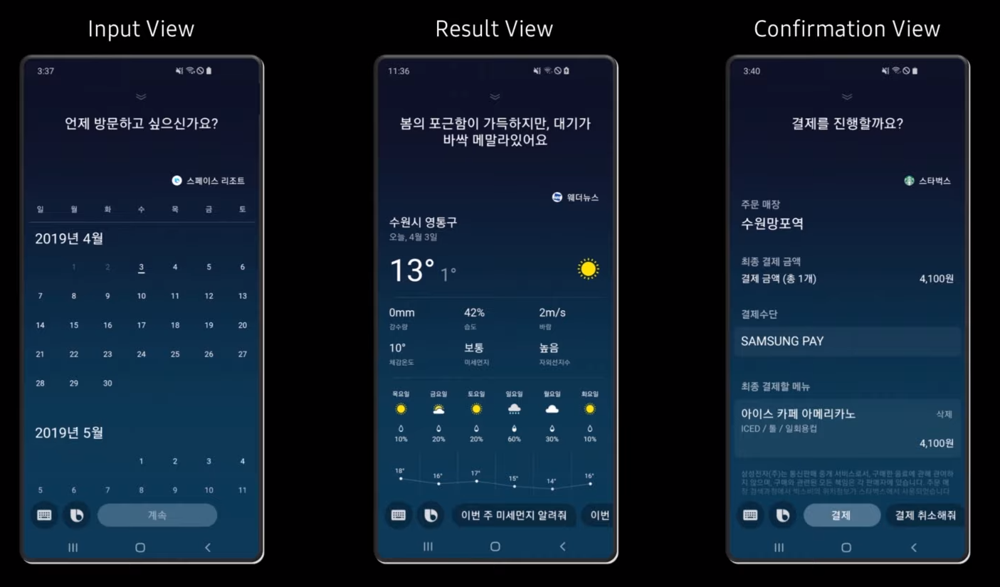
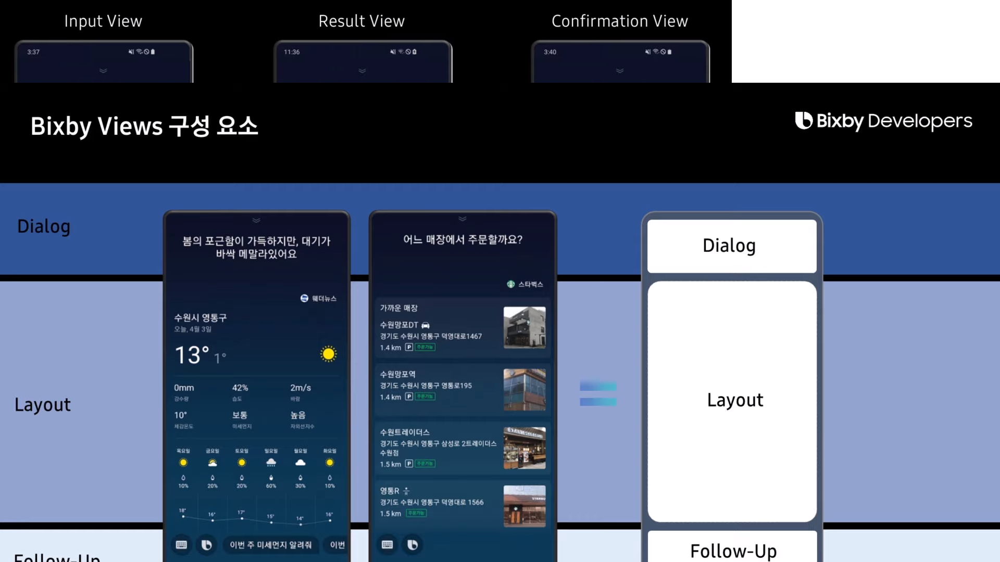

# 05강. Bixby Capsule 디자인

------

## 1. Bixby Capsule Design

### 1)  Bixby Views

- UI를 구성하는 기본 요소

  ```
  - Bixby Language를 사용하여 구현한다.
  - Layout과 Dialog, Follow-Up을 사용하여 간편하게 사용자와 대화할 수 있는 디자인을 구성할 수 있다.
  ```

- Bixby Views의 종류

  

- Bixby Views의 구성 요소

  

- Bixby Views 예시

  ```javascript
  result-view {
      // Result라는 Concept과 매칭시킴.
      match: Result(this)
      
      // Dialog에 해당된다.
      message {
          template ("결과 값을 확인해 보세요.")
      }
      
      // Layout을 구현하는 부분.
      render {
          layout-macro (result_details) {
              param (info) {
                  expression (this)
              }
          }
      }
      
      // Follow-Up에 연결된다.
      conversation-drivers{
          conversation-driver{
              template ("빼기는?")
          }
          conversation-driver{
              template ("곱하기는?")
          }
          conversation-driver{
              template ("나누기는?")
          }
          conversation-driver{
              template ("더하기는?")
          }
      }
  }
  ```

<br/>

### 2) Dialog

- 사용자와 대화하는 창구
- 설계에 따라서 현재 어떤 상황이 벌어졌는지 알려주거나, 사용자 발화의 결과를 알려줄 수도, 부가적인 정보를 요청할 수도 있다.

<br/>

### 3) Layout

- 사용자에게 다양한 경험을 제공하는 곳.
- Bixby Views의 종류에 따라 다양한 Layout을 사용할 수 있다.
- 미리 설계된 Layout Component를 활용해 직관적이고 다양한 사용자 경험을 제공할 수 있다.

<br/>

### 4) Follow-Up

- Follow-Up을 통해 Bixby와 지속적으로 대화를 이어나갈 수 있다.
- 결과 화면에서 다음 대화를 이어나갈 수 있는 힌트를 제공할 수도 있고, 후속 질문의 응답을 기반으로 다른 기능을 유도할 수도 있다.