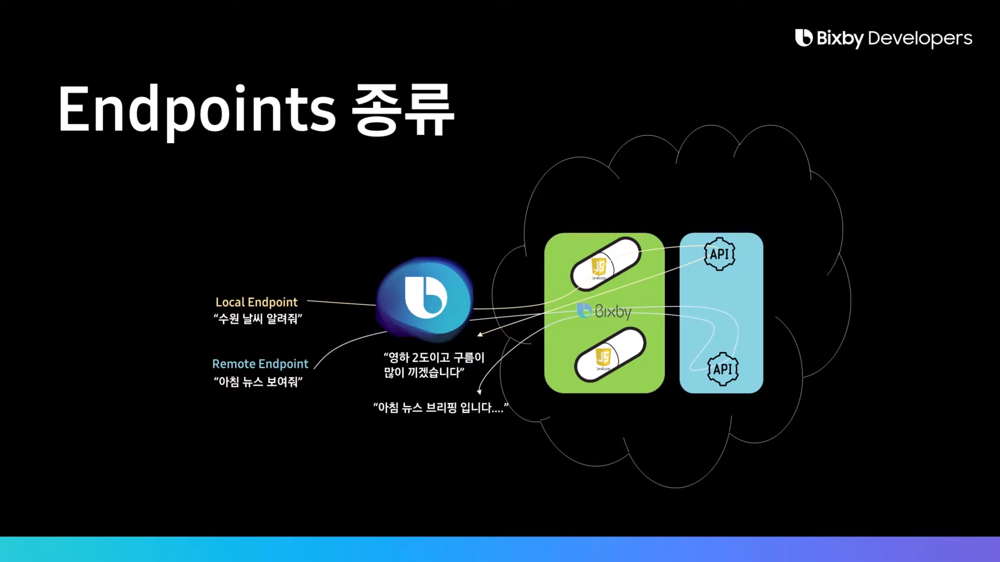
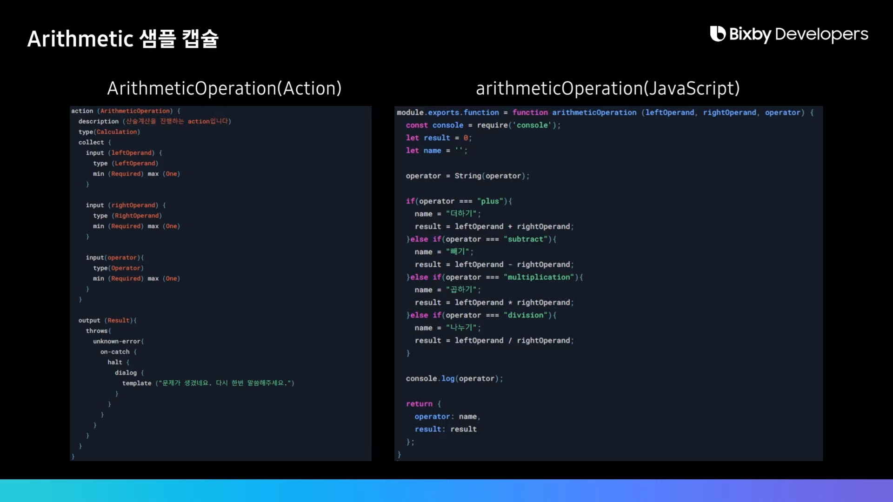

# 06강. Bixby Capsule Endpoints

------

## 1. Bixby Capsule Endpoints

### 1)  Endpoints 개요

- Endpoints란?

  모델링한 Action과 Business Logic을 연결해주는 역할. Bixby Language로 구현한다.

<br/>

### 2) Endpoints 종류



- Local Endpoint : Capsule 내부의 Resource나 코드를 사용하는 형태.
- Remote Endpoint : Capsule 내부의 js를 거치지 않고 직접 API를 호출하는 형태.

<br/>

### 3) Local Endpoint



```javascript
endpoints {
    action-endpoints {
        // 연결하고자 하는 Action 파일 이름
        action-endpoint (Operation) {
            // 연산 수행에 필요한 input 리스트
            accepted-inputs (leftOperand, rightOperand, operator)
            // 연결하고자 하는 Javascript 파일 이름
            local-endpoint (Operation.js)
        }
    }
}
```

---

## 2. Bixby Capsule로 외부 서버 연동하기

###   1) Remote Endpoint

- js코드가 필요 없지만 output Concept는 작성해 주어야 한다.